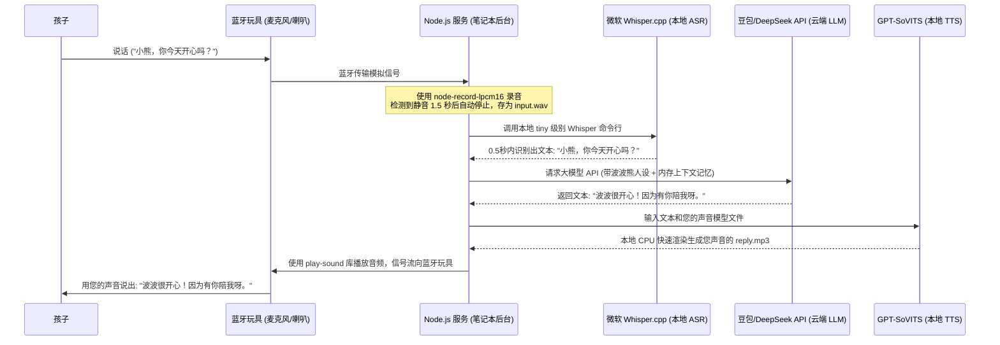

# 🧸 智能对话毛绒玩具（爸爸/妈妈声音克隆版）DIY 方案设计

本方案旨在利用低成本的免焊接硬件、一台闲置笔记本电脑、云端大模型 API 以及本地声音克隆技术，为孩子打造一个能够使用**您的声音**进行智能对话的毛绒玩具。

---

## 🛠️ 第一部分：硬件与拼装清单

为了将硬件开发难度降为 0，玩具内部采用**免焊接插头端子**进行拼装。玩具仅充当笔记本电脑的“无线蓝牙麦克风和喇叭”，所有逻辑跑在电脑上。

### 1. 采购清单 (总成本约 20 元)

*   **蓝牙 5.0 音频通话板 (带 PH2.0 插座, 带板载麦克风)**
    *   *说明*：一定要带“通话/麦克风”功能。推荐选择自带 Type-C 充电管理、自带贴片麦克风的型号。
*   **8欧 2W 小腔体扬声器 (带 PH2.0 插头)**
    *   *说明*：腔体喇叭音质更厚实，比单片喇叭更清晰。
*   **3.7V 可充电锂电池 (带 PH2.0 双线插头)**
    *   *说明*：容量选 500mAh ~ 1000mAh 即可，体积小，安全带保护板。
*   **不发热的毛绒大熊/玩具**（已有）

### 2. 拼装方法
1.  将**喇叭插头**、**电池插头**分别插在蓝牙音频主板的对应插座上，确认指示灯亮起。
2.  在毛绒玩具后背剪开小口，把海绵包裹的电路板塞入。
3.  将主板上的**贴片麦克风**位置固定在玩具嘴巴附近（在外皮上扎个针眼大小的小孔方便透音）。
4.  将**喇叭**固定在玩具肚子处。
5.  将**Type-C 充电接口**和主板自带的**开关机按键**露在玩具屁股或侧面，方便充电和开关机。

---

## 🎙️ 第二部分：声音克隆（您的声音）与录音指引

为了让玩具能用您的声音陪伴孩子，且**终身免费、永久有效**，我们使用开源的 **GPT-SoVITS** 在本地进行声音克隆和朗读合成。

### 1. 最重要的事情：录制您的原始声音语料
这些音频包是克隆您声音的唯一原材料。请在精力充沛时，严格按照以下要求录音：

*   **环境**：选择一个**极度安静、没有回音的房间**（关掉电视、风扇、空调，拉上窗帘）。
*   **设备**：嘴巴距离手机麦克风约 15 厘米，避免大声呼吸产生的“喷麦”声。
*   **录制内容**：
    1.  **日常关怀话语**：多录一些您平时想对孩子说的话，比如：“宝贝，今天开心吗？”、“要听妈妈的话哦”、“波波熊给你抱抱”。
    2.  **故事朗读**：用温柔、自然的语气朗读童话故事书（字词发音要清晰，情绪尽量丰富）。
*   **时长与格式**：累计录制 **20 分钟 ~ 1 小时**的有效音频。保存为无损格式（WAV 或 M4A），**备份在至少两处云盘和U盘里**。

### 2. 声音克隆 (GPT-SoVITS) 落地
1.  **模型训练**：使用免费的 Google Colab 云端显卡（我会为您提供一键运行脚本），上传您的声音文件，约 30 分钟即可训练完成。
2.  **生成模型**：训练完成后，会导出一个约 `60MB` 的模型文件（例如 `father_voice.pth`）。
3.  **本地合成 (TTS)**：将模型文件拷入闲置笔记本电脑。在 Node.js 中启动本地 GPT-SoVITS 推理 API。每次大模型返回文字，Node.js 自动调用这个本地模型，合成出您声音的 MP3，**完全免费且终身离线可用**。

---

## 🖧 第三部分：电脑端纯 Node.js 服务架构

闲置笔记本电脑连接玩具的蓝牙，盖子合上放在房间角落。电脑后台跑一个纯 Node.js 服务，无屏幕，零日常维护。

### 3. 永久低维护运营
*   **记忆功能**：在 Node.js 目录下建立一个 `user_profile.json`，手动录入孩子的名字、喜好、宠物。每次请求大模型时，把这些信息作为人设背景发过去，让小熊仿佛具有长期记忆。
*   **开机自启**：在电脑上写一个启动脚本。插电开机后，电脑会自动启动后台的 Node.js 录音服务、本地 ASR 和声音合成服务，不需要家人进行任何技术维护。
